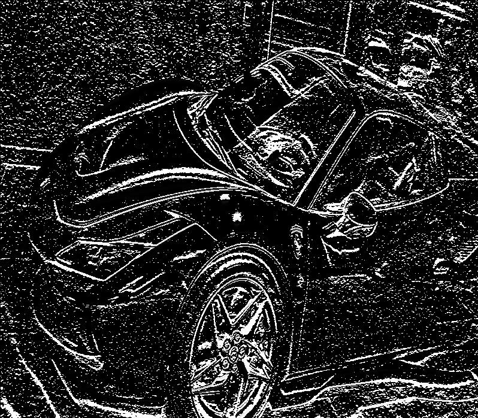
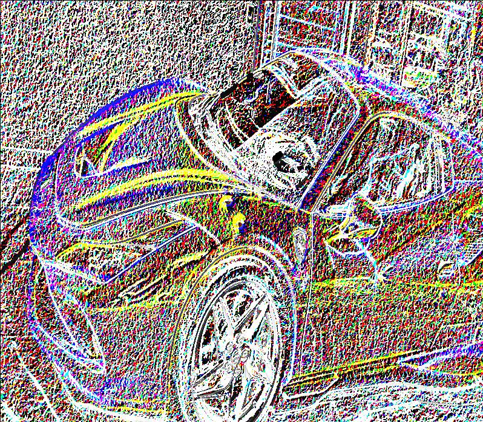

# Images to gif

```transforma_gif.py```

<br><br>

### Screenshot

<div align="center">

| all edits func | remove color range and apply alpha |
| :---: | :---: |
|  |  |

</div>

<br>

<div align='center'>

| original | both edge detection ( gray_input ) | both edge detection (colored) | channel order inverted |
| :---: | :---: | :---: | :---: |
|       ||      |       | 
 
 | 

 



</div>

---

<br>


# some options:   
   
   
### Remove range color.  


### Apply alpha.  


### Paste Image in another.  


### Glitch effect.  


### Video Make.  


### Create Gif from image or Video.  

    #### Draw function.  
  
